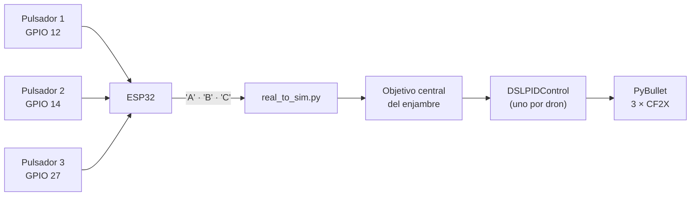
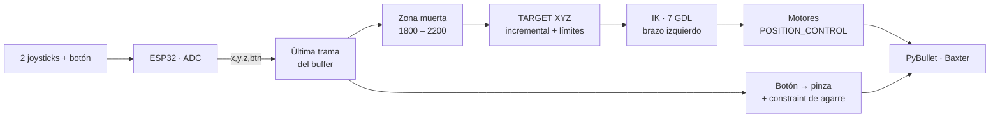
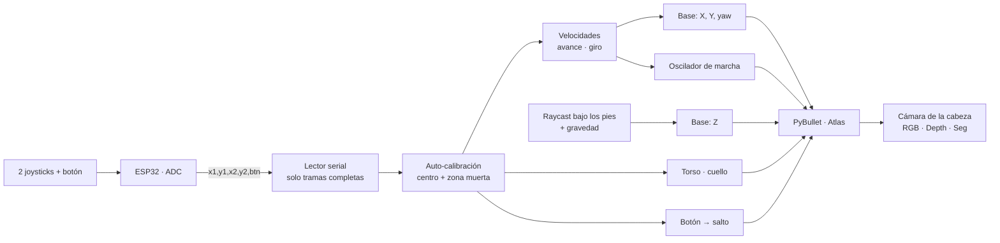

# Taller Segundo Corte · Simulación y Control Robótico en PyBullet con ESP32


| | |
|---|---|
| **Autor** | Johan — Ingeniería Mecatrónica (5.º semestre) |
| **Docente** | Ing. Diego Barragán |
| **Asignatura** | Microcontroladores |
| **Repositorio base** | [erwincoumans/pybullet_robots](https://github.com/erwincoumans/pybullet_robots) |

Este repositorio contiene el desarrollo del Taller de Segundo Corte: tres sistemas **Hardware-in-the-Loop (HIL)** en los que un ESP32 lee joysticks y pulsadores físicos y controla, en tiempo real, robots simulados en PyBullet.

| Parte | Robot | Qué se controla | Técnica principal |
|---|---|---|---|
| **A** | Enjambre de 3 drones Crazyflie 2.X | Posición del enjambre en formación | Control PID (`DSLPIDControl`) |
| **B** | Baxter (brazo izquierdo) | Efector final en XYZ + pinza | Cinemática inversa de 7 GDL + agarre por *constraint* |
| **C** | Atlas (cuerpo completo) | Caminata, giro, torso, cuello y salto | Marcha procedural + raycast al suelo + visión sintética |

---

## 📑 Contenido

1. [Arquitectura general](#-arquitectura-general)
2. [Estructura del repositorio](#-estructura-del-repositorio)
3. [Requisitos e instalación](#-requisitos-e-instalación)
4. [Paso a paso general](#-paso-a-paso-general)
5. [Parte A — Enjambre de drones](#-parte-a--control-de-enjambre-de-drones-cf2x)
6. [Parte B — Baxter con IK y agarre](#-parte-b--cinemática-inversa-y-agarre-robot-baxter)
7. [Parte C — Atlas: marcha y visión](#-parte-c--marcha-procedural-y-visión-sintética-robot-atlas)
8. [Solución de problemas](#-solución-de-problemas)
9. [Referencias](#-referencias)

---

## 🧩 Arquitectura general

Las tres partes comparten la misma cadena de datos:


**Decisiones comunes a las tres partes**

- **El ESP32 solo mide y envía.** Lee el ADC (0–4095), promedia 4 muestras por eje para reducir ruido y envía una trama de texto cada 20 ms (~50 Hz) sin usar `delay()`.
- **Python nunca se queda esperando al puerto serial.** En cada vuelta del bucle se vacía el buffer y se usa **solo la trama más reciente**, así el robot reacciona al estado actual del joystick y no a datos atrasados.
- **Toda la matemática vive en Python**, donde se puede depurar y ajustar sin volver a programar el ESP32.

---

## 📂 Estructura del repositorio

<!-- Ajusta los nombres si en tu repo son distintos -->
```text
Taller-Segundo-Corte/
├── Parte_A_Drones/
│   ├── real_to_sim.py          # Enjambre de drones controlado por pulsadores
│   └── ParteA.ino              # Firmware ESP32 (pulsadores -> 'A' / 'B' / 'C')
├── Parte_B_Baxter/
│   ├── baxter_ik_demo_2.py     # IK del brazo izquierdo + agarre
│   └── ParteB.ino              # Firmware ESP32 (x, y, z, btn)
├── Parte_C_Atlas/
│   ├── atlas_5.py              # Marcha, salto, gravedad y cámaras
│   └── ParteC.ino              # Firmware ESP32 (x1, y1, x2, y2, btn)
├── docs/
│   ├── parte_a/  parte_b/  parte_c/   # Esquemáticos y capturas
└── README.md
```

---

## 📦 Requisitos e instalación

**Software**

- Python 3.8 o superior
- Arduino IDE con el paquete de placas **ESP32 de Espressif** (placa: *ESP32 Dev Module*)
- Librerías de Python:

```bash
pip install pybullet pyserial opencv-python numpy
```

- Solo para la Parte A: [gym-pybullet-drones](https://github.com/utiasDSL/gym-pybullet-drones) (seguir las instrucciones de instalación de su repositorio).

**Modelos 3D (Partes B y C)**

Los modelos de Atlas, Baxter, `botlab.sdf` y `boston_box.urdf` **no vienen dentro de `pybullet_data`**; están en la carpeta `data` del repositorio base:

```bash
git clone https://github.com/erwincoumans/pybullet_robots.git
```

Los scripts cargan rutas relativas como `atlas/atlas_v4_with_multisense.urdf`, así que deben ejecutarse **desde `pybullet_robots/data`** (o agregar `p.setAdditionalSearchPath("ruta/a/pybullet_robots/data")` al inicio del script).

**Hardware**

- ESP32 (cualquier placa DevKit)
- 2 módulos joystick analógicos (con pulsador integrado) y/o pulsadores
- Cable USB de datos y jumpers

> ⚠️ **Alimenta los joysticks a 3.3 V, no a 5 V.** El potenciómetro entrega hasta su voltaje de alimentación directamente al pin del ESP32, y los GPIO del ESP32 no toleran 5 V.

---

## 🚀 Paso a paso general

1. **Conectar el hardware** según la tabla de pines de la parte que se va a probar (VCC → 3.3 V, GND → GND, VRx/VRy → GPIO de ADC, pulsador → GPIO y GND).
2. **Cargar el firmware:** abrir el `.ino` de la parte en Arduino IDE, seleccionar *ESP32 Dev Module* y el puerto COM, y subir.
3. **Verificar las tramas:** abrir el Monitor Serie a 115200 baudios y mover los joysticks; los números deben cambiar. **Cerrar el Monitor Serie** después (si queda abierto, Python no puede usar el puerto).
4. **Configurar el puerto** en el script de Python (`PUERTO_SERIAL = 'COM3'` por defecto; en Linux/macOS será algo como `/dev/ttyUSB0`).
5. **Ejecutar el script** desde la carpeta indicada en [Requisitos](#-requisitos-e-instalación).
6. Si el script muestra `Sin hardware serial`, el puerto está mal configurado u ocupado: la simulación abre igual, pero sin control.

---

## 🚁 Parte A — Control de enjambre de drones (CF2X)

### Descripción

Tres drones Crazyflie 2.X vuelan en formación mantenida por controladores PID de bajo nivel (`DSLPIDControl`). El usuario no pilotea cada dron: con tres pulsadores físicos elige a qué punto se desplaza el **objetivo central** del enjambre, y cada dron sigue ese objetivo manteniendo su lugar en la formación.

### Diagrama de bloques



### Hardware y mapeo

| Componente | Pin ESP32 | Carácter enviado | Acción en PyBullet |
|---|---|---|---|
| Pulsador 1 | GPIO 12 | `A` | Enjambre al centro `[0.0, 0.0, 0.5]` |
| Pulsador 2 | GPIO 14 | `B` | Diagonal derecha `[0.6, 0.6, 0.5]` |
| Pulsador 3 | GPIO 27 | `C` | Diagonal izquierda `[-0.6, 0.6, 0.5]` |

### Explicación del código

1. El ESP32 detecta qué pulsador se presionó y envía un único carácter por serial.
2. `real_to_sim.py` lee el carácter sin bloquear la simulación y actualiza el objetivo central.
3. En cada paso, el objetivo de cada dron es el objetivo central más su desplazamiento de formación.
4. `DSLPIDControl` calcula las velocidades de los motores de cada dron para llegar a su objetivo, y PyBullet simula la dinámica de vuelo.

### Evidencias

<!-- Sube el esquemático a docs/parte_a/ y ajusta la ruta -->


<!-- Arrastra el .mp4 aquí mientras editas el README en GitHub (máx. 10 MB en cuentas gratuitas; si pesa más, súbelo a YouTube/Drive y pega el enlace) -->
▶️ **Video:** Simulación del enjambre de drones

---

## 🦾 Parte B — Cinemática inversa y agarre (robot Baxter)

### Descripción

Control continuo en 3D del efector final del **brazo izquierdo** de Baxter con dos joysticks. La posición objetivo (`TARGET`) se mueve de forma incremental y la **cinemática inversa** calcula los ángulos de los 7 joints del brazo. El botón abre y cierra la pinza; si se cierra cerca del cubo, se crea una **restricción rígida** (`p.createConstraint`) que lo sujeta de forma estable.

### Diagrama de bloques



### Hardware y mapeo

**Trama serial:** `val_x,val_y,val_z,btn\n` — ejes de 0 a 4095 (reposo ≈ 2000, zona muerta 1800–2200), botón `0` = presionado, `1` = suelto.

| Control físico | Pin ESP32 | Eje en PyBullet | Valor bajo (< 1800) | Valor alto (> 2200) |
|---|---|---|---|---|
| Joystick 1 (Y) | GPIO 33 | X (rojo) | Acerca el brazo a la pantalla | Lo aleja |
| Joystick 1 (X) | GPIO 32 | Y (verde) | Extiende a la izquierda | Encoge hacia el centro |
| Joystick 2 (Z) | GPIO 34 | Z (azul) | Baja | Sube |
| Botón | GPIO 27 | Pinza | `0`: cierra (y agarra si está a < 8 cm del cubo) | `1`: abre y suelta |

### Explicación del código (`baxter_ik_demo_2.py`)

| Función / bloque | Qué hace |
|---|---|
| `setUpWorld()` | Carga el piso, Baxter con base fija y el cubo en `(0.3, 0.2, 0.05)`, una posición comprobada como alcanzable por el brazo izquierdo. |
| `getJointRanges()` | Lee los **límites articulares reales del URDF** para dárselos a la IK. |
| `accurateIK()` | Llama a `p.calculateInverseKinematics` hacia el link 48 (punto de agarre) y aplica la solución **solo a los joints 34–38, 40 y 41** (los 7 del brazo izquierdo). Usa la pose actual como `restPoses` (arranque en caliente). |
| `setMotors()` | Envía los ángulos a esos 7 joints con `POSITION_CONTROL`. |
| `ControladorPinza` | Mueve los dedos (joints 49 y 51) y crea/destruye el *constraint* de agarre. |
| Bucle principal | Lee la última trama, suma el desplazamiento al `TARGET`, lo limita a la zona alcanzable y ejecuta IK → motores → `stepSimulation()`. |

### Análisis: problemas encontrados y cómo se resolvieron

| Síntoma | Causa | Solución |
|---|---|---|
| El brazo no bajaba hasta el cubo | La IK recibía límites ficticios (−2, 2) para todos los joints. Pedía, por ejemplo, `left_e1 = −0.53 rad` cuando su límite real es −0.05 rad; el motor se frenaba en el límite y el brazo quedaba a ~34 cm del objetivo. | Límites reales del URDF → el efector llega a ~0.1 mm del objetivo. |
| La pinza no respondía | Se comandaban los joints 48 y 50: el 48 es el link del punto de agarre y el 50 es un joint fijo. | Los dedos reales son los joints **49 y 51**. |
| La pinza "se movía sola" | La IK de cuerpo completo reescribía cada frame también los dedos, el brazo derecho y la cabeza. | IK y motores restringidos a los 7 joints del brazo izquierdo. |
| El cubo salía disparado al cerrar la pinza | El contacto rígido entre una pinza pequeña y un cubo liviano es inestable en PyBullet (se probó con fuerzas desde 200 hasta 5). | Agarre por `p.createConstraint` al cerrar cerca del cubo; se elimina al abrir y el cubo cae por gravedad. |
| Retraso entre joystick y robot | Se procesaban tramas viejas acumuladas en el buffer. | Vaciar el buffer y usar solo la última trama. |
| El brazo derecho tapaba la vista | La cámara estaba del lado del hombro derecho. | Cámara reubicada del lado del brazo izquierdo (`cameraYaw = 225`). |

### Evidencias


▶️ **Video:** Cinemática inversa y agarre con Baxter

---

## 🤖 Parte C — Marcha procedural y visión sintética (robot Atlas)

### Descripción

Teleoperación completa del humanoide Atlas por el entorno industrial `botlab.sdf`. Atlas no tiene controlador de balance, así que su base se mueve **cinemáticamente** (`resetBasePositionAndOrientation`), mientras un **generador de marcha procedural** anima caderas, rodillas, tobillos y hombros con osciladores senoidales. Un sistema de **raycast** mantiene los pies sobre el suelo: el robot baja de la caja con gravedad y puede subir escalones. Desde la cabeza se renderizan tres **cámaras sintéticas** (RGB, profundidad y segmentación) en ventanas de OpenCV.

### Diagrama de bloques



### Hardware y mapeo

**Trama serial:** `val_x1,val_y1,val_x2,val_y2,btn\n`. Al iniciar, el programa **mide el reposo real de cada eje** durante ~0.8 s y usa una zona muerta de ±250 alrededor de ese centro (no hay que tocar los joysticks en ese momento).

| Control físico | Pin ESP32 | Función | Hacia valor bajo | Hacia valor alto |
|---|---|---|---|---|
| Joystick 1 (Y) | GPIO 35 | Avance de la base | Avanza (hasta 1.0 m/s) | Retrocede con marcha en reversa |
| Joystick 1 (X) | GPIO 34 | Giro de la base (yaw) | Gira a la izquierda (hasta 1.5 rad/s) | Gira a la derecha |
| Joystick 2 (X) | GPIO 33 | Giro de la cintura (`back_bkz`) | Hasta +0.66 rad | Hasta −0.66 rad |
| Joystick 2 (Y) | GPIO 32 | Inclinación del cuello (`neck_ry`) | Mira hacia abajo (hasta 1.14 rad) | Mira hacia arriba (hasta −0.60 rad) |
| Botón | GPIO 25 | Salto | `0`: dispara el salto | — |

**Teclado** (con una ventana de OpenCV activa): `q` sale del programa, `c` recalibra el reposo de los joysticks.

### Explicación del código (`atlas_5.py`)

**Orden de ejecución en cada frame (`dt` fijo = 1/240 s):**

1. Leer la última trama completa del serial y convertirla en velocidades (avance, giro) y posiciones (torso, cuello).
2. Integrar la posición y orientación de la base: $x \mathrel{+}= v\cos\psi\,\Delta t$, $y \mathrel{+}= v\sin\psi\,\Delta t$, $\psi \mathrel{+}= \dot\psi\,\Delta t$.
3. Lanzar un rayo bajo cada pie para encontrar el suelo y aplicar gravedad si no hay apoyo.
4. Avanzar el oscilador de marcha y la máquina de estados del salto.
5. Enviar los ángulos objetivo a los joints (limitados a los rangos del URDF) y ejecutar `p.stepSimulation()`.
6. Con la pose de piernas ya actualizada, colocar la base a la altura exacta para que el pie de apoyo toque el suelo.
7. Cada 5 frames, renderizar y mostrar las tres cámaras.

| Función / clase | Qué hace |
|---|---|
| `iniciarMundo()` | Carga Atlas con base fija, `botlab.sdf` (rotado de Y-arriba a Z-arriba) y la caja; **desactiva las colisiones de Atlas** para que los rayos al suelo no lo detecten a él mismo. |
| `LectorSerial` | Acumula bytes y solo entrega líneas completas; descarta la primera línea tras abrir el puerto (puede llegar cortada). |
| `Calibrador` | Toma 40 tramas en reposo, calcula la mediana de cada eje y repite si detecta que se movió un joystick. |
| `eje()` | Normaliza cada eje a −1…1 con zona muerta alrededor del centro calibrado. |
| `detectarPiso()` | Dos rayos verticales con `p.rayTestBatch` (uno bajo cada pie); devuelve el suelo más alto encontrado. |
| `plantaRelativa()` | Altura de la planta más baja respecto a la base; con ella la base baja cuando se doblan las rodillas y el pie de apoyo queda plantado. |
| `Marcha` | Oscilador de marcha (ecuaciones abajo). |
| `Salto` | Máquina de estados no bloqueante: agache → vuelo parabólico → aterrizaje. |
| `capturarCamaras()` | Construye las matrices de vista y proyección desde el link de la cabeza y genera las imágenes RGB, Depth y Seg. |

### Análisis técnico

**1. Por qué la base es cinemática.** Sin base fija, Atlas cae en caída libre (~4.6 m en el primer segundo) porque no tiene controlador de balance. Con `useFixedBase=True` la física no mueve la base; el programa la reposiciona en cada frame y los joints se animan con motores en `POSITION_CONTROL`.

**2. Oscilador de marcha.** La intensidad de la marcha depende de lo que pide el joystick:

$$
I = \min\left(1,\ \frac{|v|}{v_{max}} + \frac{|\dot\psi|}{\dot\psi_{max}}\right)
$$

La fase avanza proporcional a esa intensidad ($s = -1$ si se retrocede, así la marcha se reproduce en reversa) y la amplitud la sigue con un filtro de primer orden, para arrancar y detenerse suavemente:

$$
\varphi \leftarrow \varphi + s\, I\, \omega_{max}\, \Delta t
\qquad
a \leftarrow a + (I - a)\,\min\left(1, \frac{\Delta t}{\tau}\right)
$$

Ángulos de cada pierna (la derecha usa $\varphi + \pi$, desfasada media zancada):

$$
\theta_{cadera} = A_c\, a \sin\varphi
\qquad
\theta_{rodilla} = R_0 + A_r\, a \max(0, -\cos\varphi)
\qquad
\theta_{tobillo} = -(\theta_{cadera} + \theta_{rodilla}) + A_t\, a \max(0, \sin\varphi)
$$

- La rodilla se dobla **mientras la pierna viaja hacia adelante** (fase de vuelo), con el máximo a mitad del paso; la pierna de apoyo va casi recta.
- El tobillo compensa cadera y rodilla para mantener el pie paralelo al suelo, más un pequeño impulso de punta al final del apoyo.
- Los hombros usan la misma fase ($A_b\, a \sin(\varphi+\pi)$) en ambos brazos porque `l_arm_shz` y `r_arm_shz` están **espejados** en el URDF. El resultado es el braceo natural: cada brazo avanza junto con la pierna contraria.

**3. Salto sin bloquear el bucle.** Se mide con el mismo reloj de simulación que la marcha:

| Fase | Duración | Efecto |
|---|---|---|
| Agache | 0.15 s | Rodillas de 0 a 0.65 rad extra; cadera y tobillo compensan (pie plano) |
| Vuelo | 0.40 s | $z_{salto} = 4h\,\tau(1-\tau)$, con $h = 0.30$ m y $\tau \in [0, 1]$; las piernas se extienden |
| Aterrizaje | 0.15 s | Flexión leve que se relaja (amortiguación) |

**4. Suelo y gravedad (raycast).** Se lanzan rayos desde 0.6 m por encima del apoyo actual (altura máxima de escalón) hacia abajo. Si el suelo bajo los pies está más abajo que el apoyo, el robot cae con $v_z \leftarrow v_z - g\,\Delta t$ hasta tocarlo; si está más arriba (hasta 0.6 m), sube suavemente. La altura de la base se calcula como:

$$
z_{base} = z_{apoyo} - h_{planta} + z_{salto}
$$

donde $h_{planta}$ es la altura de la planta más baja respecto a la base. En pruebas, el pie de apoyo se mantuvo a ±3.5 mm del suelo al caminar, y la pelvis oscila ~3.4 cm por paso, como en una marcha real.

**5. Cámaras sintéticas.** La cámara sale del link de la cabeza (`neck_ry`, link 10), así que sigue tanto a la base como al cuello: mira hacia el eje +X local y usa el eje +Z local como "arriba". El buffer de profundidad de OpenGL no es lineal y se convierte a metros con:

$$
z = \frac{f\,n}{f - (f - n)\,d}
$$

($n = 0.05$ m, $f = 20$ m) y se muestra hasta 6 m con el mapa de color `COLORMAP_BONE`. En la segmentación, cada ID de objeto recibe un color fijo, siempre el mismo entre frames.

**6. `dt` fijo de 1/240 s.** El movimiento avanza lo mismo en cada frame aunque el renderizado de las cámaras tarde más en algunos: la animación nunca da saltos bruscos.

### Problemas encontrados y cómo se resolvieron

| Síntoma | Causa | Solución |
|---|---|---|
| Marcha "tiesa", casi sin mover las piernas | La marcha solo se actualizaba al llegar una trama nueva; en los demás frames la velocidad se volvía 0 y la amplitud nunca crecía. | Velocidades que se mantienen entre tramas + integración en cada frame. |
| `AttributeError: module 'pybullet' has no attribute 'rayTestAll'` | Esa función no existe en PyBullet. | `p.rayTestBatch`. |
| Atlas desaparecía de la escena | El rayo salía desde z = 2.0 y chocaba primero con el techo (≈ 1.89 m); el robot se reubicaba allá arriba. | Rayos desde la altura de apoyo + 0.6 m, y colisiones de Atlas desactivadas para que el rayo no lo detecte a él mismo. |
| Los dos brazos iban hacia adelante al mismo tiempo | Se usaban fases opuestas en hombros que ya están espejados. | Misma fase en ambos → braceo alternado. |
| El robot retrocedía solo sin tocar nada | El reposo real del eje Y (~2300) quedaba fuera de la zona muerta fija 1800–2200. | Auto-calibración del centro + zona muerta ±250 → desplazamiento en reposo: 0.000 m en 10 s. |
| Error al cerrar la ventana de PyBullet | Llamadas a PyBullet después de perder la conexión. | Bucle con `p.isConnected()`, captura de `p.error` y cierre ordenado del serial, OpenCV y PyBullet. |

### Parámetros ajustables

| Constante | Valor | Efecto |
|---|---|---|
| `VELOCIDAD_AVANCE_MAX` | 1.0 m/s | Velocidad máxima de caminata |
| `VELOCIDAD_GIRO_MAX` | 1.5 rad/s | Velocidad máxima de giro |
| `OMEGA_MARCHA_MAX` | 2π · 1.5 rad/s | Cadencia de pasos a máxima velocidad |
| `AMPLITUD_CADERA` / `RODILLA` / `TOBILLO` / `BRAZO` | 0.45 / 0.60 / 0.20 / 0.50 rad | Tamaño del paso y del braceo |
| `ALTURA_SALTO` | 0.30 m | Altura del salto |
| `ALTURA_PASO_MAX` | 0.6 m | Escalón más alto que puede subir caminando |
| `ZONA_MUERTA` | ±250 | Tolerancia alrededor del reposo del joystick |
| `CAM_CADA_N_FRAMES` | 5 | Cada cuántos frames se refrescan las cámaras (subir si el PC va lento) |

### Evidencias


▶️ **Video:** Marcha procedural y visión sintética de Atlas

---

## 🧯 Solución de problemas

| Problema | Qué revisar |
|---|---|
| `Sin hardware serial` | Puerto incorrecto en `PUERTO_SERIAL` o Monitor Serie de Arduino todavía abierto. |
| `Cannot load URDF file` | El script no se está ejecutando desde `pybullet_robots/data` (ver [Requisitos](#-requisitos-e-instalación)). |
| El ESP32 no arranca con un pulsador conectado (Parte A) | GPIO 12 es un pin de arranque: si está en alto al energizar, el ESP32 no inicia. No lo mantengas presionado al conectar. |
| Atlas se mueve solo en reposo | No toques los joysticks durante el primer segundo; presiona `c` para recalibrar. |
| Las cámaras van lentas | Aumentar `CAM_CADA_N_FRAMES` o reducir `CAM_ANCHO` / `CAM_ALTO`. |
| Lecturas del joystick erráticas | Revisar GND común y que los ejes estén en pines ADC1 (GPIO 32–39). |

---

## 📚 Referencias

- [pybullet_robots — Erwin Coumans](https://github.com/erwincoumans/pybullet_robots): modelos de Atlas, Baxter y el entorno `botlab`.
- [PyBullet Quickstart Guide](https://pybullet.org/wordpress/): documentación de `calculateInverseKinematics`, `rayTestBatch`, `getCameraImage` y `createConstraint`.
- [gym-pybullet-drones](https://github.com/utiasDSL/gym-pybullet-drones): modelo Crazyflie y controlador `DSLPIDControl`.
- [Espressif — ESP32 Arduino Core](https://github.com/espressif/arduino-esp32).
