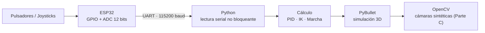
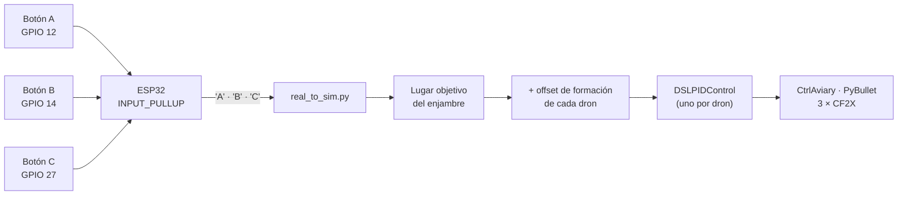
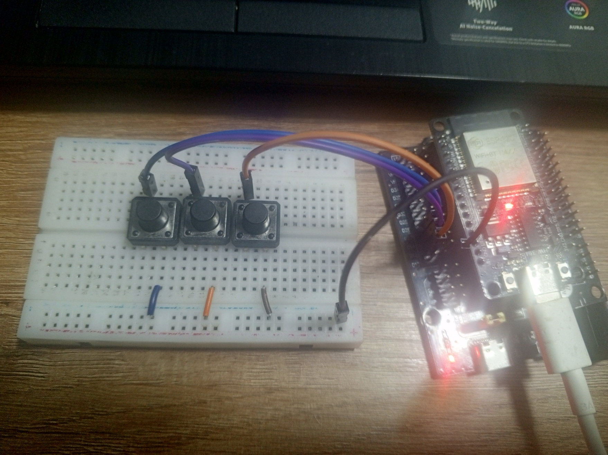
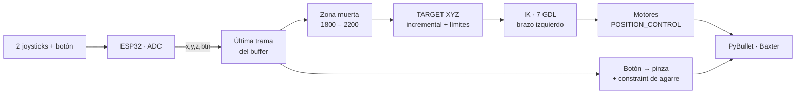
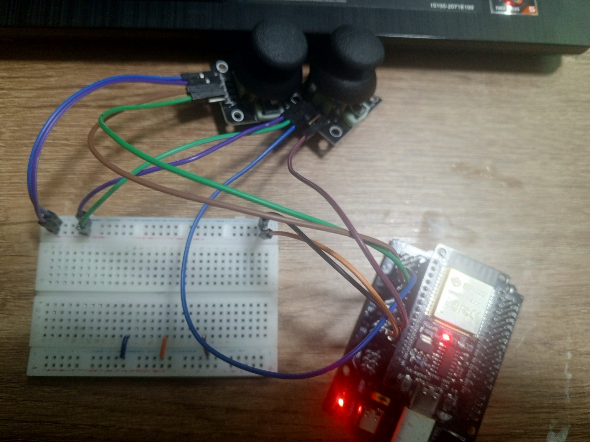
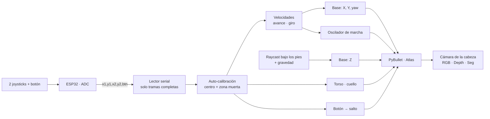
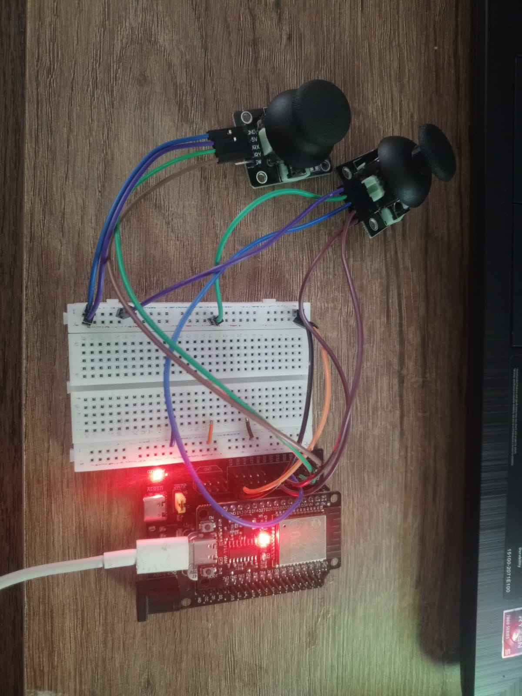

# Taller Segundo Corte · Simulación y Control Robótico en PyBullet con ESP32


| Autor | Docente | Asignatura | Repositorios base |
|---|---|---|---|
| Johan ([@Johan-C777](https://github.com/Johan-C777)) · Ingeniería Mecatrónica, 5.º semestre | Ing. Diego Barragán | Microcontroladores | [pybullet_robots](https://github.com/erwincoumans/pybullet_robots) · [gym-pybullet-drones](https://github.com/utiasDSL/gym-pybullet-drones) |

Este repositorio contiene el desarrollo de la práctica **real-to-sim** del Taller de Segundo Corte: tres sistemas **Hardware-in-the-Loop (HIL)** en los que un ESP32 lee pulsadores y joysticks físicos y controla, en tiempo real, robots simulados en PyBullet.

| Parte | Carpeta | Robot | Qué se controla | Técnica principal | Video |
|---|---|---|---|---|---|
| **A** | [`ParteA/`](ParteA) | 3 drones Crazyflie 2.X | Traslado del enjambre entre los lugares A, B y C | Control PID (`DSLPIDControl`) | [▶️ Ver](https://videotourl.com/videos/1790544207317-8ff195a3-c250-48db-9b4b-a340d6fe1d71.mp4) |
| **B** | [`ParteB/`](ParteB) | Baxter (brazo izquierdo) | Posición del efector en XYZ + pinza | Cinemática inversa de 7 GDL + agarre por *constraint* | [▶️ Ver](https://videotourl.com/videos/1790544154820-0bdca09b-9ba3-4448-ba14-9b924319cdb7.mp4) |
| **C** | [`ParteC/`](ParteC) | Atlas (cuerpo completo) | Caminata, giro, torso, cuello y salto | Marcha procedural + raycast al suelo + visión sintética | [▶️ Ver](https://videotourl.com/videos/1790544249806-e984576a-2b94-4f1f-860c-8d0606ce4bba.mp4) |

---

## 📑 Contenido

1. [Enunciado y cumplimiento](#-enunciado-y-cumplimiento)
2. [Arquitectura general](#-arquitectura-general)
3. [Estructura del repositorio](#-estructura-del-repositorio)
4. [Requisitos](#-requisitos)
5. [Paso a paso de ejecución](#-paso-a-paso-de-ejecución)
6. [Parte A — Enjambre de drones](#-parte-a--movimiento-del-enjambre-de-drones-entre-a-b-y-c)
7. [Parte B — Baxter: IK y agarre](#-parte-b--consola-de-mandos-para-baxter-ik--agarre)
8. [Parte C — Atlas: marcha y visión](#-parte-c--consola-de-mandos-para-atlas-marcha--visión-sintética)
9. [Solución de problemas](#-solución-de-problemas)
10. [Referencias](#-referencias)

---

## 📋 Enunciado y cumplimiento

> *"El taller se debe desarrollar en un repositorio de GitHub denominado 'Taller Segundo Corte', donde desarrollarán un readme.md y en este procederán a mostrar la arquitectura, el análisis desarrollado del proyecto y el paso a paso a seguir, donde pueden adjuntar vídeos del funcionamiento y los códigos con su respectiva explicación."*

| Requisito | Dónde se encuentra |
|---|---|
| Arquitectura | [Arquitectura general](#-arquitectura-general) y un diagrama de bloques en cada parte |
| Análisis del proyecto | Secciones *Análisis* de las partes [A](#-parte-a--movimiento-del-enjambre-de-drones-entre-a-b-y-c), [B](#-parte-b--consola-de-mandos-para-baxter-ik--agarre) y [C](#-parte-c--consola-de-mandos-para-atlas-marcha--visión-sintética) |
| Paso a paso | [Paso a paso de ejecución](#-paso-a-paso-de-ejecución) |
| Videos de funcionamiento | Sección *Evidencias* de cada parte |
| Códigos con explicación | Carpetas `ParteA/`, `ParteB/`, `ParteC/` y sección *Explicación del código* de cada parte |

---

## 🧩 Arquitectura general

Las tres partes comparten la misma cadena de datos:



El ESP32 solo **mide y envía**; toda la matemática vive en Python, donde se puede ajustar sin volver a programar la placa. En ninguna parte el bucle de simulación se queda esperando al puerto serial.

| | Parte A | Parte B | Parte C |
|---|---|---|---|
| **Entradas** | 3 pulsadores | 2 joysticks (3 ejes) + botón | 2 joysticks (4 ejes) + botón |
| **Trama enviada** | `A` / `B` / `C` | `x,y,z,btn` | `x1,y1,x2,y2,btn` |
| **Envío desde el ESP32** | Solo al presionar (antirrebote de 300 ms) | Cada 30 ms (~33 Hz) | Cada 20 ms (~50 Hz) con `millis()`, promedio de 4 muestras por eje |
| **Lectura en Python** | `readline()` solo si hay datos | Vacía el buffer y usa la última trama | Solo tramas completas + auto-calibración del reposo |

---

## 📂 Estructura del repositorio

```text
Taller-Segundo-Corte/
├── ParteA/
│   ├── Montaje_Botones.jpg      # Foto del montaje físico (3 pulsadores)
│   ├── ParteA.ino               # Firmware ESP32: pulsadores -> 'A' / 'B' / 'C'
│   └── real_to_sim.py           # Enjambre de 3 drones con DSLPIDControl
├── ParteB/
│   ├── Montaje_Joysticks.jpg    # Foto del montaje físico (2 joysticks)
│   ├── ParteB.ino               # Firmware ESP32: trama x,y,z,btn
│   └── baxter_ik_demo.py        # IK del brazo izquierdo de Baxter + agarre
├── ParteC/
│   ├── Montaje_Joysticks2.jpg   # Foto del montaje físico (2 joysticks)
│   ├── ParteC.ino               # Firmware ESP32: trama x1,y1,x2,y2,btn
│   └── atlas.py                 # Marcha, salto, gravedad y cámaras de Atlas
└── README.md
```

---

## 📦 Requisitos

**Software**

- Windows con PowerShell (los comandos de abajo están escritos para Windows).
- Python 3.8 o superior.
- Arduino IDE con el paquete de placas **ESP32 de Espressif** (placa: *ESP32 Dev Module*).
- Repositorios base descargados:
  - [pybullet_robots](https://github.com/erwincoumans/pybullet_robots) (Partes B y C). Contiene los modelos de Baxter y Atlas y el entorno `botlab`.
  - [gym-pybullet-drones](https://github.com/utiasDSL/gym-pybullet-drones) (Parte A). Contiene el modelo Crazyflie y `DSLPIDControl`.

**Hardware**

- ESP32 DevKit y cable USB **de datos**.
- 3 pulsadores (Parte A) y 2 módulos joystick analógicos con pulsador (Partes B y C).
- Jumpers y protoboard.

> [!WARNING]
> **Alimenta los joysticks a 3.3 V, no a 5 V.** El potenciómetro del joystick entrega hasta su voltaje de alimentación directamente al pin del ESP32, y los GPIO del ESP32 no toleran 5 V.

---

## 🚀 Paso a paso de ejecución

### 1. Cargar el firmware en el ESP32

1. Arma el circuito de la parte que vas a probar según su tabla de pines (ver cada parte y su foto de montaje).
2. Abre el `.ino` de esa parte en Arduino IDE, selecciona **ESP32 Dev Module** y el puerto COM, y súbelo.
3. Abre el Monitor Serie a **115200 baudios** y verifica que lleguen las tramas al mover los joysticks o presionar los botones.
4. **Cierra el Monitor Serie.** Si queda abierto, Python no puede usar el puerto.
5. Revisa en *Administrador de dispositivos → Puertos (COM y LPT)* qué COM tiene el ESP32. Los scripts usan **`COM3`** por defecto; si el tuyo es otro, cámbialo en el script: `PUERTO_SERIAL` en Partes B y C, y `serial.Serial('COM3', ...)` en la Parte A.

> [!CAUTION]
> **Paso cero: permisos de Windows (solo si falla el activador del entorno virtual).**
> Si al activar el entorno aparece en rojo que *"la ejecución de scripts está deshabilitada"*, pega esto en la terminal y presiona Enter:
>
> ```powershell
> Set-ExecutionPolicy -Scope Process -ExecutionPolicy Bypass
> ```
>
> Solo aplica a esa ventana de PowerShell; no cambia la configuración del sistema.

### 2. Simulación de robots (Parte B · Baxter y Parte C · Atlas)

1. Copia `ParteB/baxter_ik_demo.py` y `ParteC/atlas.py` dentro de la carpeta descargada de **pybullet_robots**, reemplazando los originales.
2. Entra a esa carpeta exacta:

   ```powershell
   cd .\pybullet_robots-master\pybullet_robots-master
   ```

3. Solo la primera vez, crea el entorno virtual e instala las dependencias:

   ```powershell
   python -m venv .venv
   .\.venv\Scripts\Activate.ps1
   pip install pybullet pyserial opencv-python numpy
   ```

4. Las siguientes veces, solo activa el entorno. Debes ver `(.venv)` en verde al inicio de la línea:

   ```powershell
   .\.venv\Scripts\Activate.ps1
   ```

5. Ejecuta el script del robot que necesites:

   ```powershell
   python atlas.py
   ```

   Cambia `atlas.py` por `baxter_ik_demo.py` para la Parte B.

> [!NOTE]
> Los scripts deben ejecutarse **desde la raíz de `pybullet_robots`**. Ahí está la carpeta `data`, de donde PyBullet carga `atlas/...`, `baxter_common/...`, `botlab/...` y `boston_box.urdf`.

> [!IMPORTANT]
> **Parte C:** no toques los joysticks durante el primer segundo. El programa está midiendo el punto de reposo de cada eje (en la consola aparece `Centros de reposo (x1, y1, x2, y2): [...]`).

### 3. Simulación de drones (Parte A)

1. Entra a la carpeta descargada de **gym-pybullet-drones**, la que contiene `setup.py` o `pyproject.toml` (ajusta la ruta a donde lo descomprimiste).
2. Solo la primera vez, crea el entorno e instala la librería y `pyserial`:

   ```powershell
   python -m venv .venv
   .\.venv\Scripts\Activate.ps1
   pip install -e .
   pip install pyserial
   ```

3. Copia `ParteA/real_to_sim.py` a `gym_pybullet_drones\examples\`, entra ahí y ejecútalo:

   ```powershell
   cd .\gym_pybullet_drones\examples
   python real_to_sim.py
   ```

4. Presiona los botones A, B y C para mover el enjambre. Cierra la ventana de PyBullet para terminar; al cerrar se guardan los registros de vuelo en `results/` y se muestran las gráficas.

---

## 🚁 Parte A — Movimiento del enjambre de drones entre A, B y C

### Enunciado

> *"a- Mover los drones de un lugar a un lugar b y a un lugar c, teniendo presente que el control se gestionará desde la esp32."*

**Cómo se cumple:** cada botón físico del ESP32 corresponde a un lugar. Al presionarlo, el enjambre completo de tres drones vuela a ese lugar manteniendo su formación.

### Diagrama de bloques



### Hardware y mapeo

Cada pulsador va entre su GPIO y **GND**, sin resistencias externas, porque el firmware usa `INPUT_PULLUP` (presionado = `LOW`).

| Pulsador | Pin ESP32 | Carácter enviado | Lugar | Coordenada del objetivo |
|---|---|---|---|---|
| Botón A | GPIO 12 | `A` | Centro | `[0.0, 0.0, 0.5]` |
| Botón B | GPIO 14 | `B` | Diagonal derecha | `[0.6, 0.6, 0.5]` |
| Botón C | GPIO 27 | `C` | Diagonal izquierda | `[-0.6, 0.6, 0.5]` |

> [!NOTE]
> GPIO 12 es un pin de arranque del ESP32: debe estar en bajo al energizar. Con el botón a GND (como en este montaje) no hay problema; no le agregues una resistencia *pull-up* externa.

### Explicación del código

**`ParteA.ino`**: configura los tres pines con `INPUT_PULLUP`. Cuando uno lee `LOW`, envía su letra con `Serial.println()` y espera 300 ms como antirrebote, para que un solo toque no envíe varias letras.

**`real_to_sim.py`** está basado en el ejemplo `pid.py` de gym-pybullet-drones:

| Bloque | Qué hace |
|---|---|
| `INIT_XYZS` / `INIT_RPYS` | Posiciones y orientaciones iniciales de los 3 drones: forman un arco de radio 0.3 m con alturas escalonadas. Estas posiciones también definen la **forma de la formación**. |
| `base_target` | Lugar actual del enjambre. Arranca en A `[0, 0, 0.5]`. |
| `CtrlAviary(...)` | Crea el entorno con 3 drones CF2X, física a 240 Hz, control a 48 Hz y obstáculos de ejemplo. |
| `DSLPIDControl` (×3) | Un controlador PID por dron. |
| Lectura serial | Si hay datos (`ser.in_waiting > 0`), lee una línea y cambia `base_target` según la letra recibida; si no hay datos, la simulación sigue sin esperar. |
| Bucle de control | Para cada dron: `objetivo = INIT_XYZS[j] + base_target` → `computeControlFromState()` → RPM de los motores. |
| `sync()` | Mantiene la simulación a velocidad de tiempo real. |
| `except p.error` | Al cerrar la ventana de PyBullet, el bucle termina limpiamente, se guardan los registros (`logger.save()`, CSV) y se grafican. |

### Análisis

**Formación.** El objetivo de cada dron *j* es su posición inicial más el lugar elegido:

$$
\mathbf{p}^{\,obj}_j = \mathbf{p}^{\,0}_j + \mathbf{p}_{lugar},
\qquad
\mathbf{p}^{\,0}_j = \left[R\cos\left(\tfrac{j\pi}{3}+\tfrac{\pi}{2}\right),\ R\sin\left(\tfrac{j\pi}{3}+\tfrac{\pi}{2}\right)-R,\ H + j\,\Delta H\right]
$$

con $R = 0.3$ m, $H = 0.1$ m y $\Delta H = 0.05$ m. Como a todos los drones se les suma el mismo desplazamiento, la formación se traslada **sin deformarse**. En el lugar A los drones quedan en $(0, 0, 0.60)$, $(-0.26, -0.15, 0.65)$ y $(-0.26, -0.45, 0.70)$ m; la separación en altura evita que un dron quede dentro de la estela de otro.

**Control.** `DSLPIDControl` es un PID en cascada: un lazo externo convierte el error de posición en el empuje y la actitud deseados, y un lazo interno convierte el error de actitud en las RPM de los cuatro motores. El lugar objetivo cambia de golpe al presionar un botón, y el PID genera una transición suave hasta el nuevo punto.

**Recorridos.** A→B y C→A son de 0.85 m en el plano; B→C es de 1.2 m. Las coordenadas se eligieron para que el enjambre no salga del encuadre de la cámara.

### Evidencias

**Montaje físico**

<p align="center"></p>

**Video de funcionamiento**

[](https://videotourl.com/videos/1790544207317-8ff195a3-c250-48db-9b4b-a340d6fe1d71.mp4)

---

## 🦾 Parte B — Consola de mandos para Baxter (IK + agarre)

### Enunciado

> *"b- Desarrollar una consola de mandos con la esp32 para un movimiento fluido del robot Baxter que permita una movilidad real de brazos y posicionamiento, además de que el robot pueda coger y mover un objeto."*

**Cómo se cumple:**

- **Movilidad real y posicionamiento:** dos joysticks mueven el efector del brazo izquierdo de forma continua en X, Y y Z. La cinemática inversa calcula los 7 ángulos del brazo en cada ciclo.
- **Movimiento fluido:** el movimiento es incremental y proporcional a cuánto se inclina el joystick. Python siempre usa la trama más reciente, así no se acumula retraso.
- **Coger y mover un objeto:** el botón cierra la pinza. Si está cerca del cubo, este queda sujeto, se puede llevar a otro lugar y se suelta al abrir.

### Diagrama de bloques



### Hardware y mapeo

**`ParteB.ino`** lee los tres ejes con `analogRead()` (12 bits, 0–4095) y el botón con `INPUT_PULLUP`, y envía `x,y,z,btn` cada 30 ms. El reposo de los joysticks queda cerca de 2000; la zona muerta es 1800–2200. El botón envía `0` al presionarse y `1` al soltarse.

| Control físico | Pin ESP32 | Eje en PyBullet | Valor bajo (< 1800) | Valor alto (> 2200) |
|---|---|---|---|---|
| Joystick 1 (Y) | GPIO 33 | X (rojo) | Acerca el brazo a la pantalla | Lo aleja |
| Joystick 1 (X) | GPIO 32 | Y (verde) | Extiende a la izquierda | Encoge hacia el centro |
| Joystick 2 (Z) | GPIO 34 | Z (azul) | Baja | Sube |
| Botón | GPIO 27 | Pinza | `0`: cierra (y agarra si está a < 8 cm del cubo) | `1`: abre y suelta |

### Explicación del código (`baxter_ik_demo.py`)

Está basado en el `baxter_ik_demo.py` original de pybullet_robots.

| Función / bloque | Qué hace |
|---|---|
| `setUpWorld()` | Carga el piso, Baxter con base fija y el cubo en `(0.3, 0.2, 0.05)`, una posición comprobada como alcanzable por el brazo izquierdo. |
| `getJointRanges()` | Lee los **límites articulares reales del URDF** para dárselos a la IK. |
| `accurateIK()` | Llama a `p.calculateInverseKinematics` hacia el link 48 (punto de agarre) y aplica la solución **solo a los joints 34–38, 40 y 41** (los 7 del brazo izquierdo). Usa la pose actual como `restPoses` (arranque en caliente). |
| `setMotors()` | Envía los ángulos a esos 7 joints con `POSITION_CONTROL`. |
| `ControladorPinza` | Mueve los dedos (joints 49 y 51) y crea o destruye el *constraint* de agarre. |
| `dibujarEjesReferencia()` | Dibuja los ejes X (rojo), Y (verde) y Z (azul) para verificar el mapeo del joystick. |
| `leerUltimaLinea()` | Vacía el buffer serial y devuelve solo la trama más reciente. |
| Bucle principal | Lee la trama, suma el desplazamiento al `TARGET`, lo limita a la zona alcanzable y ejecuta IK → motores → `stepSimulation()`. |

### Análisis

**Posición objetivo.** Cada eje del joystick suma un desplazamiento proporcional a cuánto sale de la zona muerta. Por ejemplo, en X:

$$
x_{k+1} = \operatorname{clip}\big(x_k + K\,(1800 - u_y),\ x_{min},\ x_{max}\big) \quad \text{si } u_y < 1800
$$

con $K = 3\times10^{-5}$ m por unidad de ADC por lectura. Los límites `LIMITE_X`, `LIMITE_Y` y `LIMITE_Z` encierran la zona que el brazo izquierdo alcanza realmente, así el objetivo no puede irse al infinito.

**Problemas encontrados y cómo se resolvieron:**

| Síntoma | Causa | Solución |
|---|---|---|
| El brazo no bajaba hasta el cubo | La IK recibía límites ficticios (−2, 2) para todos los joints. Pedía, por ejemplo, `left_e1 = −0.53 rad` cuando su límite real es −0.05 rad; el motor se frenaba en el límite y el brazo quedaba a ~34 cm del objetivo. | Límites reales del URDF → el efector llega a ~0.1 mm del objetivo. |
| La pinza no respondía | Se comandaban los joints 48 y 50: el 48 es el link del punto de agarre y el 50 es un joint fijo. | Los dedos reales son los joints **49 y 51**. |
| La pinza "se movía sola" | La IK de cuerpo completo reescribía cada frame también los dedos, el brazo derecho y la cabeza. | IK y motores restringidos a los 7 joints del brazo izquierdo. |
| El cubo salía disparado al cerrar la pinza | El contacto rígido entre una pinza pequeña y un cubo liviano es inestable en PyBullet (se probó con fuerzas desde 200 hasta 5). | Agarre por `p.createConstraint` al cerrar cerca del cubo; se elimina al abrir y el cubo cae por gravedad. |
| Retraso entre joystick y robot | Se procesaban tramas viejas acumuladas en el buffer. | Vaciar el buffer y usar solo la última trama. |
| El brazo derecho tapaba la vista | La cámara estaba del lado del hombro derecho. | Cámara reubicada del lado del brazo izquierdo (`cameraYaw = 225`). |

### Evidencias

**Montaje físico**

<p align="center"></p>

**Video de funcionamiento**

[](https://videotourl.com/videos/1790544154820-0bdca09b-9ba3-4448-ba14-9b924319cdb7.mp4)

---

## 🤖 Parte C — Consola de mandos para Atlas (marcha + visión sintética)

### Enunciado

> *"c- Desarrollar una consola de mandos con la esp32 para un movimiento fluido del robot [Atlas] que permita una movilidad real."*
>
> La imagen de referencia del enunciado muestra al robot Atlas en el entorno `botlab` con tres paneles de cámara sintética: RGB, profundidad y segmentación.

**Cómo se cumple:**

- **Movilidad real:** Atlas camina hacia adelante y hacia atrás, gira, rota la cintura, inclina el cuello y salta. Además baja de la caja con gravedad y puede volver a subir.
- **Movimiento fluido:** la marcha se genera con osciladores senoidales que arrancan y se detienen suavemente, y avanza con un paso de tiempo fijo.
- **Visión:** las tres cámaras sintéticas de la imagen de referencia se muestran en tiempo real desde la cabeza del robot.

### Diagrama de bloques



### Hardware y mapeo

**`ParteC.ino`** promedia 4 lecturas por eje para reducir el ruido del ADC y envía `x1,y1,x2,y2,btn` cada 20 ms usando `millis()`, sin `delay()`. Al iniciar, `atlas.py` **mide el reposo real de cada eje** durante ~0.8 s y usa una zona muerta de ±250 alrededor de ese centro.

| Control físico | Pin ESP32 | Función | Hacia valor bajo | Hacia valor alto |
|---|---|---|---|---|
| Joystick 1 (Y) | GPIO 35 | Avance de la base | Avanza (hasta 1.0 m/s) | Retrocede con la marcha en reversa |
| Joystick 1 (X) | GPIO 34 | Giro de la base (yaw) | Gira a la izquierda (hasta 1.5 rad/s) | Gira a la derecha |
| Joystick 2 (X) | GPIO 33 | Giro de la cintura (`back_bkz`) | Hasta +0.66 rad | Hasta −0.66 rad |
| Joystick 2 (Y) | GPIO 32 | Inclinación del cuello (`neck_ry`) | Mira hacia abajo (hasta 1.14 rad) | Mira hacia arriba (hasta −0.60 rad) |
| Botón | GPIO 25 | Salto | `0`: dispara el salto | — |

**Teclado** (con una ventana de OpenCV activa): `q` sale del programa y `c` recalibra el reposo de los joysticks.

### Explicación del código (`atlas.py`)

**Orden de ejecución en cada frame (`dt` fijo = 1/240 s):**

1. Leer la última trama completa del serial y convertirla en velocidades (avance, giro) y posiciones (torso, cuello).
2. Integrar la posición y orientación de la base: $x \mathrel{+}= v\cos\psi\,\Delta t$, $y \mathrel{+}= v\sin\psi\,\Delta t$, $\psi \mathrel{+}= \dot\psi\,\Delta t$.
3. Lanzar un rayo bajo cada pie para encontrar el suelo y aplicar gravedad si no hay apoyo.
4. Avanzar el oscilador de marcha y la máquina de estados del salto.
5. Enviar los ángulos objetivo a los joints, limitados a los rangos del URDF, y ejecutar `p.stepSimulation()`.
6. Con la pose de las piernas ya actualizada, colocar la base a la altura exacta para que el pie de apoyo toque el suelo.
7. Cada 5 frames, renderizar y mostrar las tres cámaras.

| Función / clase | Qué hace |
|---|---|
| `iniciarMundo()` | Carga Atlas con base fija, `botlab.sdf` (rotado de Y-arriba a Z-arriba) y la caja. **Desactiva las colisiones de Atlas** para que los rayos al suelo no lo detecten a él mismo. |
| `LectorSerial` | Acumula bytes y solo entrega líneas completas. Descarta la primera línea tras abrir el puerto, que puede llegar cortada. |
| `Calibrador` | Toma 40 tramas en reposo, calcula la mediana de cada eje y repite la medición si detecta que se movió un joystick. |
| `eje()` | Normaliza cada eje a −1…1 con zona muerta alrededor del centro calibrado. |
| `detectarPiso()` | Dos rayos verticales con `p.rayTestBatch`, uno bajo cada pie; devuelve el suelo más alto encontrado. |
| `plantaRelativa()` | Altura de la planta más baja respecto a la base. Con ella la base baja cuando se doblan las rodillas y el pie de apoyo queda plantado. |
| `Marcha` | Oscilador de marcha (ecuaciones abajo). |
| `Salto` | Máquina de estados no bloqueante: agache → vuelo parabólico → aterrizaje. |
| `capturarCamaras()` | Construye las matrices de vista y proyección desde el link de la cabeza y genera las imágenes RGB, Depth y Seg. |

### Análisis

**1. Por qué la base es cinemática.** Sin base fija, Atlas cae en caída libre (~4.6 m en el primer segundo) porque no tiene controlador de balance. Con `useFixedBase=True` la física no mueve la base: el programa la reposiciona en cada frame (`resetBasePositionAndOrientation`) y los joints se animan con motores en `POSITION_CONTROL`.

**2. Oscilador de marcha.** La intensidad de la marcha depende de lo que pide el joystick:

$$
I = \min\left(1,\ \frac{|v|}{v_{max}} + \frac{|\dot\psi|}{\dot\psi_{max}}\right)
$$

La fase avanza proporcional a esa intensidad, y la amplitud la sigue con un filtro de primer orden para arrancar y detenerse suavemente. Con $s = -1$ al retroceder, la marcha se reproduce en reversa:

$$
\varphi \leftarrow \varphi + s\, I\, \omega_{max}\, \Delta t
\qquad
a \leftarrow a + (I - a)\,\min\left(1, \frac{\Delta t}{\tau}\right)
$$

Ángulos de cada pierna. La derecha usa $\varphi + \pi$, es decir, va desfasada media zancada:

$$
\theta_{cadera} = A_c\, a \sin\varphi
\qquad
\theta_{rodilla} = R_0 + A_r\, a \max(0, -\cos\varphi)
\qquad
\theta_{tobillo} = -(\theta_{cadera} + \theta_{rodilla}) + A_t\, a \max(0, \sin\varphi)
$$

- La rodilla se dobla **mientras la pierna viaja hacia adelante** (fase de vuelo), con el máximo a mitad del paso; la pierna de apoyo va casi recta.
- El tobillo compensa cadera y rodilla para mantener el pie paralelo al suelo, y suma un pequeño impulso de punta al final del apoyo.
- Los hombros usan la misma fase en ambos brazos ($A_b\, a \sin(\varphi+\pi)$) porque `l_arm_shz` y `r_arm_shz` están **espejados** en el URDF. El resultado es el braceo natural: cada brazo avanza junto con la pierna contraria.

**3. Salto sin bloquear el bucle.** Se mide con el mismo reloj de simulación que la marcha:

| Fase | Duración | Efecto |
|---|---|---|
| Agache | 0.15 s | Las rodillas se flexionan hasta 0.65 rad extra; cadera y tobillo compensan para mantener el pie plano. |
| Vuelo | 0.40 s | $z_{salto} = 4h\,\tau(1-\tau)$, con $h = 0.30$ m y $\tau \in [0, 1]$; las piernas se extienden. |
| Aterrizaje | 0.15 s | Flexión leve que se relaja (amortiguación). |

**4. Suelo y gravedad (raycast).** Los rayos salen desde 0.6 m por encima del apoyo actual, que es la altura máxima de escalón, y van hacia abajo. Si el suelo bajo los pies está más abajo que el apoyo, el robot cae con $v_z \leftarrow v_z - g\,\Delta t$ hasta tocarlo. Si está más arriba (hasta 0.6 m), sube suavemente. La altura de la base es:

$$
z_{base} = z_{apoyo} - h_{planta} + z_{salto}
$$

donde $h_{planta}$ es la altura de la planta más baja respecto a la base. En pruebas, el pie de apoyo se mantuvo a ±3.5 mm del suelo al caminar, y la pelvis osciló ~3.4 cm por paso, como en una marcha real.

**5. Cámaras sintéticas.** La cámara sale del link de la cabeza (`neck_ry`, link 10), así que sigue tanto a la base como al cuello: mira hacia el eje +X local y usa el eje +Z local como "arriba". El buffer de profundidad de OpenGL no es lineal y se convierte a metros con

$$
z = \frac{f\,n}{f - (f - n)\,d}
$$

donde $n = 0.05$ m y $f = 20$ m. La profundidad se muestra hasta 6 m con el mapa de color `COLORMAP_BONE`. En la segmentación, cada objeto recibe un color fijo, siempre el mismo entre frames.

**6. `dt` fijo de 1/240 s.** El movimiento avanza lo mismo en cada frame aunque el renderizado de las cámaras tarde más en algunos, así la animación nunca da saltos bruscos.

**Problemas encontrados y cómo se resolvieron:**

| Síntoma | Causa | Solución |
|---|---|---|
| Marcha "tiesa", casi sin mover las piernas | La marcha solo se actualizaba al llegar una trama nueva; en los demás frames la velocidad volvía a 0 y la amplitud nunca crecía. | Velocidades que se mantienen entre tramas e integración en cada frame. |
| `AttributeError: module 'pybullet' has no attribute 'rayTestAll'` | Esa función no existe en PyBullet. | `p.rayTestBatch`. |
| Atlas desaparecía de la escena | El rayo salía desde z = 2.0 y chocaba primero con el techo (≈ 1.89 m), así que el robot se reubicaba allá arriba. | Rayos desde la altura de apoyo + 0.6 m y colisiones de Atlas desactivadas para que el rayo no lo detecte a él mismo. |
| Los dos brazos iban hacia adelante al mismo tiempo | Se usaban fases opuestas en hombros que ya están espejados. | Misma fase en ambos → braceo alternado. |
| El robot retrocedía solo sin tocar nada | El reposo real del eje Y (~2300) quedaba fuera de la zona muerta fija 1800–2200. | Auto-calibración del centro + zona muerta de ±250 → desplazamiento en reposo: 0.000 m en 10 s. |
| Error al cerrar la ventana de PyBullet | Llamadas a PyBullet después de perder la conexión. | Bucle con `p.isConnected()`, captura de `p.error` y cierre ordenado del serial, OpenCV y PyBullet. |

**Parámetros ajustables:**

| Constante | Valor | Efecto |
|---|---|---|
| `VELOCIDAD_AVANCE_MAX` | 1.0 m/s | Velocidad máxima de caminata |
| `VELOCIDAD_GIRO_MAX` | 1.5 rad/s | Velocidad máxima de giro |
| `OMEGA_MARCHA_MAX` | 2π · 1.5 rad/s | Cadencia de pasos a máxima velocidad |
| `AMPLITUD_CADERA` / `RODILLA` / `TOBILLO` / `BRAZO` | 0.45 / 0.60 / 0.20 / 0.50 rad | Tamaño del paso y del braceo |
| `ALTURA_SALTO` | 0.30 m | Altura del salto |
| `ALTURA_PASO_MAX` | 0.6 m | Escalón más alto que puede subir caminando |
| `ZONA_MUERTA` | ±250 | Tolerancia alrededor del reposo del joystick |
| `CAM_CADA_N_FRAMES` | 5 | Cada cuántos frames se refrescan las cámaras (súbelo si el PC va lento) |

### Evidencias

**Montaje físico**

<p align="center"></p>

**Video de funcionamiento**

[](https://videotourl.com/videos/1790544249806-e984576a-2b94-4f1f-860c-8d0606ce4bba.mp4)

---

## 🧯 Solución de problemas

| Problema | Qué revisar |
|---|---|
| *"La ejecución de scripts está deshabilitada"* al activar `.venv` | Ejecutar el [paso cero](#1-cargar-el-firmware-en-el-esp32) (`Set-ExecutionPolicy -Scope Process -ExecutionPolicy Bypass`). |
| `Sin hardware serial` (B y C) o `No se pudo conectar al puerto Serial` (A) | COM incorrecto en el script, Monitor Serie de Arduino todavía abierto o cable USB que solo carga. |
| El ESP32 no aparece en *Puertos (COM y LPT)* | Instalar el driver USB-serial de la placa (CP210x o CH340) y probar con un cable de datos. |
| `Cannot load URDF file` | El script no se ejecutó desde la raíz de `pybullet_robots` (donde está la carpeta `data`). |
| `pip install pybullet` falla compilando | Instalar *Microsoft C++ Build Tools* o usar una versión de Python con rueda precompilada de PyBullet. |
| Atlas se mueve solo en reposo | No toques los joysticks durante el primer segundo; presiona `c` para recalibrar. |
| Las cámaras de Atlas van lentas | Aumentar `CAM_CADA_N_FRAMES` o reducir `CAM_ANCHO` / `CAM_ALTO`. |
| Lecturas del joystick erráticas | Revisar que la GND sea común y que los ejes estén en pines ADC1 (GPIO 32–39). |

---

## 📚 Referencias

- [pybullet_robots — Erwin Coumans](https://github.com/erwincoumans/pybullet_robots): modelos de Atlas y Baxter, entorno `botlab` y demos originales `atlas.py` y `baxter_ik_demo.py`.
- [gym-pybullet-drones — utiasDSL](https://github.com/utiasDSL/gym-pybullet-drones): modelo Crazyflie 2.X, `CtrlAviary`, `DSLPIDControl` y el ejemplo `pid.py`.
- [PyBullet Quickstart Guide](https://pybullet.org/wordpress/): documentación de `calculateInverseKinematics`, `rayTestBatch`, `getCameraImage` y `createConstraint`.
- [Espressif — ESP32 Arduino Core](https://github.com/espressif/arduino-esp32).
